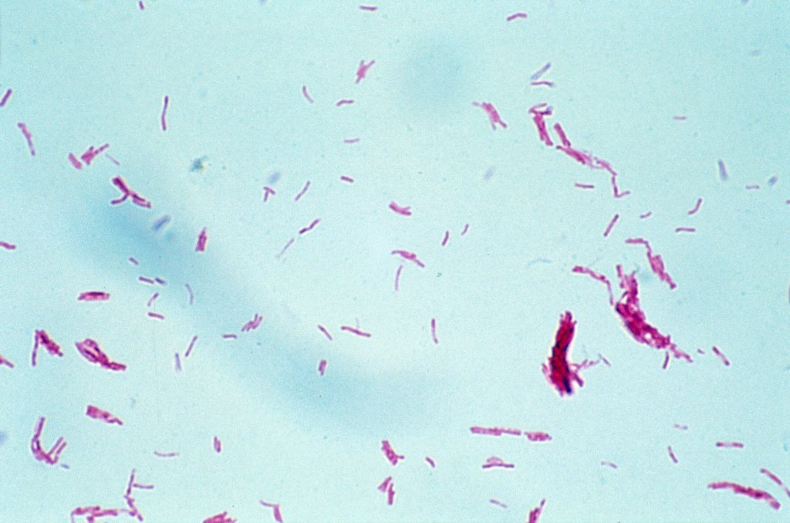

# Introduction

What will you learn today?

1.  What is an [**infectious disease**]{style="color:purple"}, what is an [**outbreak**]{style="color:purple"} and who are [**disease detectives**]{style="color:purple"}?
2.  How can [**R**]{style="color:purple"} be used to investigate outbreaks?
3.  Then [**YOU**]{style="color:purple"} are going to [**solve an outbreak**]{style="color:purple"}!

The slides for this workshop can be found [here](https://r-ladiesmelbourne.github.io/It-Takes-a-Spark-Slides/#/TitleSlide)!

## What are infectious diseases?

Infectious diseases are caused by certain microorganisms, such as [bacteria, viruses, parasites or funghi]{style="color:purple"}, and will make people (or animals) sick when they are exposed to these microorganisms. Most microorganisms don't make us sick, but some do, and these are known as [pathogens]{style="color:purple"}. There are lots of different ways that you might get an infectious disease. Some ways include breathing respiratory droplets, eating contaminated food or water, insect bites and many many more !

## What is a disease OUTBREAK?

The [World Health Organisation]{style="color:purple"} definition of an [outbreak]{style="color:purple"} as:

> the ["occurence of disease in excess of normal"]{style="color:purple"}. 

In other words, a disease outbreak is the occurrence of cases of disease in excess of what would normally be expected in a defined community, geographical area or season. An outbreak may occur in a restricted geographical area, or may extend over several countries. It may last for a few days or weeks, or for several years.

This might be caused from a new pathogen, bringing pathogens to new areas, a mutating pathogen.
Many infectious diseases now have vaccines that mean outbreaks to these pathogens occur much less frequently (for example: measles, chicken pox, influenza etc.). 

## Viruses

### 2023: Novovirus Outbreak {.unnumbered}

:::: {style="display: flex;"}

::: {}

{width="500"}

:::

::: {}
- Norovirus causes [vomitting]{style="color:purple"} and [diarrhoaea]{style="color:purple"} (you might call this gastro)

- It is extremely stable in the environment and highly contagious

- [Ingesting]{style="color:purple"} norovirus causes disease

- There is [no vaccine]{style="color:purple"} available for norovirus

:::

::::

### 2019: COVID-19 {.unnumbered}

:::: {style="display: flex;"}

::: {}

{width=400}
:::

::: {}
- The COVID-19 pandemic was caused by a virus known as [SARS-CoV2]{style="color:purple"}. It caused a global [pandemic.]{style="color:purple"}

- A [pandemic]{style="color:purple"} is defined as an infectious disease that is affecting multiple parts of the world, i.e. multiple countries or continents are experiencing an [epidemic]{style="color:purple"}

- There are now several types of vaccines that have helped to reduce the severity of this infection

:::

::::

### 2014: Ebola {.unnumbered}

:::: {style="display: flex;"}

::: {}

{width="200"}

::: 

::: {}

- Ebola virus disease (EVD) is a severe fever that often causes fatal illness and affects humans and other primates. 

- This [**virus**]{style="color:purple"} is transmitted to people from animals (e.g., fruit bats, porcupines) 

- Ebola spreads in human populations by direct contact with [**blood, secretions, organs or other bodily fluids of infected people, and contaminated surfaces and materials**]{style="color:purple"}

- The first outbreaks occurred in villages in Central Africa and the 2014-2016 outbreak was the largest. 

For more information on the 2014-2016 **Ebola** outbreak see the World Health Organisation [website](https://www.who.int/health-topics/ebola#tab=tab_1). 

:::

::::

### 2009: Swine Flu {.unnumbered}

:::: {style="display: flex;"}

::: {}

{width="400"}

::: 

::: {}

- "Swine-Flu" or the 2009-2010 H1N1 Influenza A outbreak was the first recorded time in human history that this virus caused infections in humans. 

- It was called swine flu and was a combination of influenza viruses that infect pigs, birds and humans. 

- It was declared as a [**pandemic**]{style="color:purple"} by the World Health Organisation in 2009 and there were approximately 284,400 deaths worldwide.

- [**Symptoms**]{style="color:purple"} include fever, cough, runny nose and red eyes. 

- This virus continues to circulate as a seasonal virus. 

- The seasonal flu vaccine now helps protect against this [**strain**]{style="color:purple"} of flu and other seasonal flu viruses. 

For more information see the World Health Organisation [website](https://www.who.int/emergencies/situations/influenza-a-(h1n1)-outbreak). 

:::

::::

## Bacteria

### _Mycobacterium ulcerans_: Buruli ulcer {.unnumbered}

:::: {style="display: flex;"}

::: {}

{width="500"}

::: 

::: {}
- Buruli ulcer is caused by a bacteria known as *[Mycobacterium ulcerans]{style="color:purple"}*

- The bacteria is [slow growing and flesh eating]{style="color:purple"} and is [endemic]{style="color:purple"} to Melbourne and surrounds

- [Endemic]{style="color:purple"} means that there is an ongoing transmission of a pathogen in that area

- Mode of transmission not entirely understood but likely involves [mosquitoes]{style="color:purple"} and [possums]{style="color:purple"}

- Jan 2024 Update ! [Scientists find out how *M. ulcerans* is spread](https://www.doherty.edu.au/news-events/news/80-year-mystery-solved-mosquitoes-spread-flesh-eating-buruli-ulcer).
:::

::::

### _Yersinia pestis_: Black Death {.unnumbered}

:::: {style="display: flex;"}

::: {}

{width="500"}

::: 

::: {}

- The [**Plague**]{style="color:purple"} or [**Black Death**]{style="color:purple"} is a disease caused by a bacteria known as [*Yersinia pestis*]{style="color:purple"}. 

- Infections occur when humans are bitten by a [**rodent flea**]{style="color:purple"} that carries this bacterium or by [**an infected animal**]{style="color:purple"}. 

- This disease was infamous in killing millions of people in Europe in the [**Middle Ages**]{style="color:purple"}. 

- [**Symptoms**]{style="color:purple"} include headache, chills, weakness, swollen lymph nodes, among others depending on the type (Bubonic, Septicemic, Pneumonic). 

- But today we have modern antibiotics that can treat [*Yersinia pestis*]{style="color:purple"}.

More information on the **plague** can be found on the Centre for Disease Control [website](https://www.cdc.gov/plague/index.html) and the World Health Organisation [website](https://www.who.int/news-room/fact-sheets/detail/plague). 

:::

::::

## Who are real-life disease detectives?

-   [Public health departments]{style="color:purple"} in the government
    -  How to improve the health of everyone
-   [Academic research]{style="color:purple"} at Research Institutes and Universities
    -   Make new discoveries, such as developing new drugs or vaccines
-   [Doctors]{style="color:purple"} and [health staff]{style="color:purple"}
    -   Keep their patients safe
    
And many others too !

An [**epidemiologist**]{style="color:purple"} is someone who investigates the patterns and causes of [**health**]{style="color:purple"} and [**disease**]{style="color:purple"}. 

## What do real-life disease detectives do?

-   What is the problem ?

-   What is the cause?

-   What can we do to make the situation better ?
