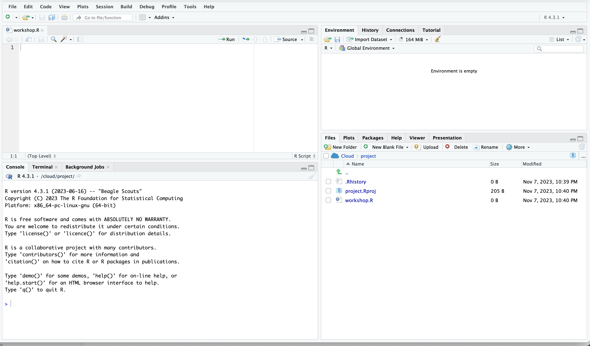

# The Basics

```{r, echo = F}
knitr::opts_chunk$set(comment = "", prompt = T, class.source="Rchunk", class.output="Rout")
```

## R can be our calculator

Addition (use `+`).

```{r addition test}
2+2
```

Multiplication (use `*`).

```{r multiplication test}
2*6
```

Division (use `/`).

```{r division test}
150/3
```

...anything is possible

```{r combination maths test}
((2+3)*8)/123
```

::: {#teaching_moment_1 .yellowbox}

💡 Type in your numbers either within the **workshop.R** file (TOP-RIGHT) or within the **console** (BOTTOM-RIGHT). Then to run - click **Run** at the top of the **.R** script or type `ctrl/cmd` + `enter`. The answer prints in the **console**.

<p align="center" width="100%">
    
</p>

:::


## R can be our notebook

We can [save]{style="color:purple"} important information for later.

We can use `<-` or `=`

```{r}
my_name <- "Caitlin"
paste("My name is", my_name)
```

```{r}
several_names <- c("Caitlin", "Dionne", "Lauren")
paste("My name is", several_names)
```

```{r}
a_number <- 137
another_number <- 120

a_number * another_number
```

```{r}
a_number / another_number
```

```{r}
(2*a_number) + another_number
```

::: {#teaching_moment_2 .yellowbox}
💡 Students are encouraged to make their own variable names and get used to R coding symbols
:::
