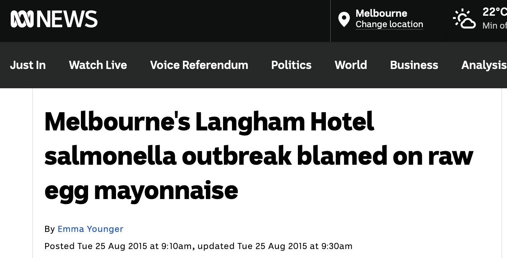

# Challenge Two

```{r, echo = F}
library(tidyverse)
library(ggmap)
knitr::opts_chunk$set(comment = "", prompt = T, class.source="Rchunk", class.output="Rout")
```

**Where did the students get sick?**

-   At the gallery?
-   On the bus?
-   At lunch?

## We have some more information

We have just been sent some information about where the student's ate lunch. They ate at three different restaurants! 

```{r echo=F, message=F, warning=F}
source(here::here("setup/map.R"))
```

```{r}
ggmap(melb_map)+
   geom_point(data=map_data, aes(x =long, y = lat, colour = sickness), size = 12, shape = 1)
```

## Based on a real life outbreak in Melbourne !



Read more at the ABC [website](https://www.abc.net.au/news/2015-08-25/raw-egg-mayonnaise-blamed-for-langham-hotel-salmonella-outbreak/6722062). 

**What does the health department do next? What can consumers do?**
