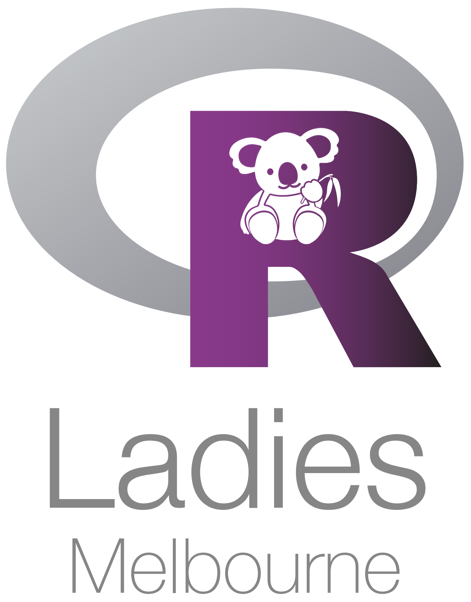

# About us
:::: {style="display: flex;"}

::: {}

{width=2in}  

:::

::: {.col data-latex="{0.1\textwidth}"}
\ 
<!-- a larger empty space to create a bigger gap -->
\ \ \ \ 
:::
::: {}

Caitlin, Dionne, and Lauren are from R Ladies Melbourne, and we are here because we want to teach you how to program in R!

[**R-Ladies**]{style="color:purple"} is a [world-wide organisation]{style="color:purple"} whose mission is to [promote gender diversity]{style="color:purple"} in the [R community]{style="color:purple"}. 

See the [R-Ladies global website](https://rladies.org/) or [R-Ladies Melbourne](https://www.meetup.com/rladies-melbourne) for more information! 

The slides for this worksho can be found [here](https://r-ladiesmelbourne.github.io/It-Takes-a-Spark-Slides/#/TitleSlide).

:::

::::

## What is coding and what is R?


[Coding]{style="color:purple"} is writing instructions that a machine or computer can understand to perform a task.

R is a [programming language]{style="color:purple"} and [free software environment]{style="color:purple"} for [statistical computing]{style="color:purple"} and [graphics]{style="color:purple"}. It is used in statistics, data science and many other disciplines. It is also a very powerful tool for visualising data. 

{width="200"} {width="360"} {width="230"} {width="130"}

## Why learn R?

-   R is free and open source
-   Learning R is fun and easy
-   Lots of libraries
-   Want the coolest job?

[Who uses R?]{style="color:purple"} Academics and Industry, including:

-   Facebook
-   Google
-   Twitter
-   McKinsey & Company
-   Microsoft
-   Ford
-   BCG
-   Uber


```{r eval=FALSE, include=FALSE}
bookdown::serve_book()
bookdown::render_book("index.Rmd", "bookdown::gitbook")
bookdown::publish_book(render = "local")
```

```{r include=FALSE}
# automatically create a bib database for R packages
knitr::write_bib(c(.packages(), 'bookdown', 'knitr', 'rmarkdown', 'tidyverse', 'ggmap'), 'packages.bib')
```


## Do you want to learn more?

[RStudio Education for Beginners](https://education.rstudio.com/learn/beginner/)

[R for Data Science](https://r4ds.had.co.nz/)

[The Epidemiologist R Handbook](https://epirhandbook.com/en/)

[R You With Me](https://rladiessydney.org/courses/ryouwithme/)

[R-Graph Gallery](https://r-graph-gallery.com/)